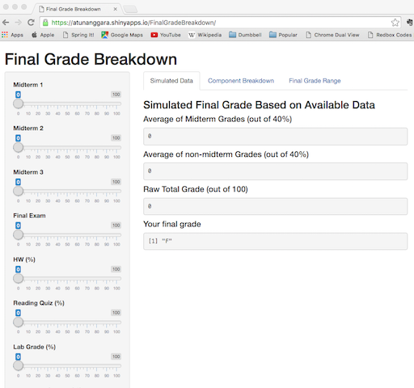

## Motivation and Introduction of the App

When students get their midterm grade, they often do not know how to interpret their scores with respect to their final grades. This shiny Final Grade Breakdown app is created to help students see their standings in the class with their given grades so far.

The application calculate final grade based on each component earned in the span of a course. Total final grades can be broken down into: 

1. Midterm exams (40%)
2. Final exam (20%)
3. Homework (10%)
4. Reading Quiz (5%)
5. Laboratory grade (15%)
6. Discussion section (10%)

Once the data is weighted, the program will convert the raw numerical total grade (out of 100) into a letter grade (from A to F). 

--- .class #id 

## Shiny App: FinalGradeBreakdown



[Final Grade Breakdown App hosted by shinyapps.io](https://atunanggara.shinyapps.io/FinalGradeBreakdown)

--- .class #id 
## Computational Background

Average of midterm grades:

$$latex
\frac{\text{Midterm 1}+\text{Midterm 2}+\text{Midterm 3}}{3} \times \frac{4}{10}
$$

Average of non-midterm grades:
$$latex
\text{HW} \times 0.10 + \text{Reading Quiz} \times 0.05 + \text{Laboratory Grade} \times 0.15 + \text{Discussion Section} \times 0.10
$$

Total grades:
$$latex
\text{average of midterm grades} + \text{average of non-midterm grades} + \text{final exam score} \times 0.20
$$

Letter grades: 

If total grades fall on the scale of 0-59: F, 60-69: D, 70-72: C-, 73-76: C, 77-79: C+, 80-82: B-, 83-86: B, 87-89: B+, 90-92: A-, 93-100: A

--- .class #id 

## Static Example: FinalGradeBreakdown App

If I were to input: Midterm exams: 95, 75, 85 on all three midterms, Final exam: 60%, Homework: 90%, Reading Quiz: 100 %, Laboratory grade: 90%, and Discussion section: 100%. The shiny app will run r codes and produced: 


```
## Average of Midterm Grades (out of 40%): 34
```

```
## Average of non-midterm Grades (out of 40%): 37.5
```

```
## Raw Total Grade (out of 100): 83.5
```

```
## Your final grade: B
```

[Github Repository](https://github.com/atunanggara/DDP-Shiny)

If you have any questions or comments, feel free to contact me!

